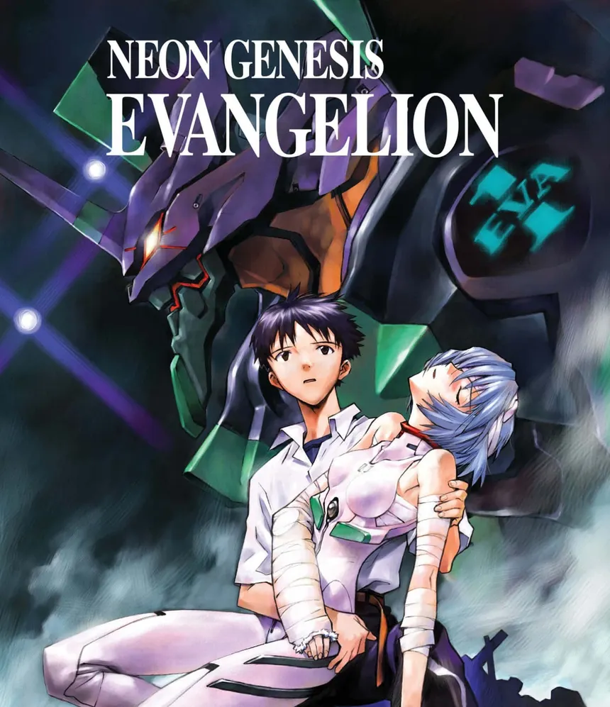
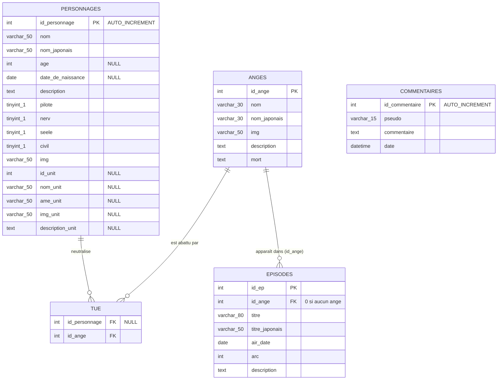

# ⚡ NGE Database — SAE 203 Wiki

<div align="center">



[](https://www.php.net/)
[](https://www.mysql.com/)
[](https://developer.mozilla.org/fr/docs/Web/HTML)
[](https://developer.mozilla.org/fr/docs/Web/CSS)
[](https://developer.mozilla.org/fr/docs/Web/JavaScript)

<p align="center">
  <b>Interface interactive NERV HQ pour la consultation et l'exploration de l'univers de Neon Genesis Evangelion.</b>
</p>

[Aperçu](#-aperçu--fonctionnalités) •
[Architecture](#-architecture--structure-du-projet) •
[Base de Données](#-schéma-de-la-base-de-données) •
[Installation](#-installation--démarrage-rapide) •
[Conception UI/UX](#-direction-artistique--design) •
[Technologies](#-tech-stack)

---

</div>

## 📌 Présentation du Projet

Ce projet a été réalisé dans le cadre de la **SAE 203** (Semestre 2 - BUT Métiers du Multimédia et de l'Internet).

> **Problématique centrale :**
> _« Comment concevoir une interface fluide, ergonomique et immersive permettant de consulter des données interconnectées depuis une base de données MySQL et d'interagir avec ces contenus ? »_

L'application prend la forme d'un **terminal d'archive NERV (Tokyo-3)** dédié à l'univers culte de la franchise **_Neon Genesis Evangelion_** (Gainax / Hideaki Anno). Elle propose une expérience visuelle et sonore (typographies officielles) inspirée des moniteurs d'alerte de l'anime tout en implémentant une architecture **MVC (Modèle - Vue - Contrôleur)** en PHP natif.

---

## 🌟 Aperçu & Fonctionnalités

### 🖥️ 1. Landing & Hub Central (`index.php`)

- **Écran d'accueil typographique** reprenant l'esthétique des cartons de titres et moniteurs NERV.
- **Compteurs dynamiques en temps réel** interrogeant la BDD pour afficher les totaux : épisodes (+ _The End of Evangelion_), personnages répertoriés, anges et unités Evangelion.

### 👤 2. Fichiers du Personnel — Personnages (`characters.php`, `character-info.php`)

- Grille complète des protagonistes et antagonistes (Pilotes, NERV, SEELE, Civils).
- **Moteur de recherche instantané** en JavaScript par filtrage du DOM en temps réel.
- **Filtrage multicritère par badges d'affiliation** (NERV, SEELE, Pilote, Civil) combinable avec la recherche texte.
- **Fiches détaillées individuelles** : identité complète, kanji, âge, date de naissance formatée (`DATE_FORMAT`), bio et liens d'affectation aux unités EVA.

### 🎬 3. Archives de Diffusion — Épisodes (`episodes.php`, `episode-info.php`)

- Liste chronologique des 26 épisodes de la série culte + le film conclusif _The End of Evangelion_.
- **Filtrage par arcs narratifs** (`Ep. 01-06`, `Ep. 07-13`, `Ep. 14-19`, `Ep. 20-26`).
- **Fiches d'épisodes détaillées** : titre japonais original, date de première diffusion, synopsis complet et ange intervenant lié via jointure SQL.

### 🤖 4. Fichiers des Unités EVA (`units.php`, `unit-info.php`)

- Catalogue des Evangelions (Unit-00, Unit-01, Unit-02, Unit-03, Unit-04, Mass Production...).
- Filtres par matrice d'âme résidente (**Yui**, **Kyoko**, **Autre / Inconnue**).
- Fiches d'unités détaillant le pilote attitré, l'âme synchronisée et les spécifications de l'unité.

### 👁️ 5. Fichiers des Anges (`angels.php`, `angel-info.php`)

- Registre des entités extraterrestres et menaces bibliques (du 1er au 17ème Ange : Adam, Sachiel, Ramiel, Kaworu...).
- Fiches détaillées indiquant les capacités, circonstances de mort et personnage responsable de leur neutralisation (table relationnelle `tue`).

### 💬 6. Terminal de Commentaires Universel (CRUD - Interaction Utilisateur)

- **Volet latéral coulissant (Drawer)** accessible sur toutes les pages via le bouton flottant NERV.
- Ajout de messages avec pseudonyme, message multiligne et horodatage automatique via SQL `NOW()`.
- Affichage chronologique des interventions formatées (`%d/%m/%Y, %H:%i`).

---

## 🗂 Architecture & Structure du Projet

Le projet adopte une séparation claire des responsabilités inspirée du pattern **MVC (Modèle-Vue-Contrôleur)** :

```
SAE203/
├── index.php                 # Point d'entrée : Accueil & stats globales
├── characters.php            # Point d'entrée : Galerie des personnages
├── character-info.php        # Point d'entrée : Fiche détaillée personnage
├── episodes.php              # Point d'entrée : Liste des épisodes & arcs
├── episode-info.php          # Point d'entrée : Fiche détaillée épisode
├── units.php                 # Point d'entrée : Galerie des unités EVA
├── unit-info.php             # Point d'entrée : Fiche détaillée unité EVA
├── angels.php                # Point d'entrée : Répertoire des Anges
├── angel-info.php            # Point d'entrée : Fiche détaillée Ange
│
├── controller/
│   └── controller.php        # Routeur central aiguillant vers les vues selon $page
│
├── model/
│   └── model.php             # Couche d'accès aux données (PDO MySQL, requêtes préparées/fonctions)
│
├── view/                     # Vues & composants graphiques (Templates PHP/HTML)
│   ├── view-index.php
│   ├── view-characters.php
│   ├── view-character-info.php
│   ├── view-episodes.php
│   ├── view-episode-info.php
│   ├── view-units.php
│   ├── view-unit-info.php
│   ├── view-angels.php
│   └── view-angel-info.php
│
├── js/                       # Scripts front-end interactifs (Vanilla ES6)
│   ├── comments.js           # Gestion de l'ouverture/fermeture du drawer commentaires
│   ├── filter.js             # Logique de filtrage dynamique (personnages & unités)
│   ├── filter-episodes.js    # Filtrage par arcs narratifs
│   ├── search-global.js      # Recherche dynamique instantanée sur les grilles
│   └── search-episodes.js    # Recherche instantanée dans les listes d'épisodes
│
├── css/                      # Feuilles de styles & Design System NERV
│   ├── fontface.css          # Déclarations des polices MatissePro et HelveticaNeue
│   ├── style-global.css      # Variables CSS, layout global, drawer commentaires, cartes
│   ├── style-index.css       # Style spécifique du carton de titre d'accueil
│   ├── style-episodes.css    # Style de la liste des épisodes
│   └── style-info.css        # Style des fiches d'informations détaillées
│
└── assets/                   # Ressources statiques
    ├── favicon.ico
    ├── fonts/                # Polices WOFF2 (MatissePro, HelveticaNeue)
    ├── img/                  # Images de couverture, personnages, anges et EVAs
    └── svg/                  # Icônes vectorielles (message.svg, cross.svg)
```

---

## 🗄 Schéma de la Base de Données

La base de données relationnelle (`nge_db` / `4a6ctm_nge_db`) est structurée autour de **5 tables**, dont une table de relation n-n (`tue`) et une table de liaison logique (`episodes` -> `anges`) :



### 🔍 Détails des Tables & Relations :

- **`personnages`** : Entité centrale contenant à la fois l'état civil, les drapeaux booléens d'organisation (`pilote`, `nerv`, `seele`, `civil`) et les caractéristiques de l'Evangelion assignée (`id_unit`, `nom_unit`, `ame_unit`, `description_unit`, `img_unit`).
- **`anges`** : Répertoire des 17 Anges avec nom (anglais/kanji), description et circonstances de destruction (`mort`).
- **`episodes`** : Les 26 épisodes de la série répertoriés par arc narratif, avec référence vers l'Ange affronté (`id_ange`).
- **`tue`** : Table de jointure (relation n-n) enregistrant les éliminations d'Anges par les personnages / pilotes de NERV.
- **`commentaires`** : Table indépendante alimentée par le terminal utilisateur avec horodatage MySQL.

---

## 🎨 Direction Artistique & Design

L'interface a été conçue pour offrir une immersion immédiate dans l'ambiance visuelle légendaire de Studio Gainax et Hideaki Anno :

- **Typographie officielle :** Utilisation des polices emblématiques de l'anime :
  - **Matisse Pro** : Pour les kanjis et titrages dramatiques.
  - **Helvetica Neue** : Pour les métadonnées techniques et labels informatiques.
- **Palette NERV UI :**
  - Noir profond `#000000` & Rouge d'alerte `#c0392b`.
  - Accents blancs `#ffffff` et contrastes semi-transparents `rgba(255, 255, 255, 0.4)`.
- **UI Terminal / Moniteur :**
  - Coins de cadrage vectoriels (_framing corners_).
  - Badges d'état et codes de section techniques (`[ SRH ]`, `NERV HQ — Tokyo-3`, `EVA-WIKI >`).
  - Drawer latéral rétractable avec bascule d'icône fluide.

---

## 🛠 Tech Stack

| Couche                   | Technologies          | Utilisation                                                                     |
| :----------------------- | :-------------------- | :------------------------------------------------------------------------------ |
| **Backend**              | **PHP (7.4+)**        | Routage contrôleur, requêtes dynamiques PDO, templating serveur                 |
| **Base de Données**      | **MySQL / MariaDB**   | Stockage relationnel, requêtes d'agrégation (`COUNT`), jointures (`LEFT JOIN`)  |
| **Frontend**             | **HTML5 sémantique**  | Balisage accessible, formulaires et conteneurs structurés                       |
| **Style & UI**           | **CSS3 Modern**       | Variables CSS (Custom Properties), Flexbox, CSS Grid, Responsive Design         |
| **Interactivité**        | **JavaScript (ES6+)** | Filtrage dynamique du DOM en direct, drawer asynchrone, manipulation de classes |
| **Typographie & Assets** | **WOFF2 & SVG**       | Polices Matisse Pro & Helvetica Neue intégrées localement, icônes vectorielles  |

---

## 🚀 Installation & Démarrage Rapide

### Prérequis

- Un serveur web local type [XAMPP](https://www.apachefriends.org/), [WAMP](https://www.wampserver.com/), [MAMP](https://www.mamp.info/) ou [Laragon](https://laragon.org/).
- PHP 7.4 ou version supérieure.
- MySQL 5.7 ou MariaDB 10.4+.

### Étapes d'installation

1. **Cloner le dépôt dans votre répertoire web (`htdocs` ou `www`) :**

   ```bash
   git clone https://github.com/votre-compte/SAE203.git
   cd SAE203
   ```

2. **Créer la base de données :**
   - Ouvrez votre gestionnaire MySQL (ex: **phpMyAdmin** sur `http://localhost/phpmyadmin`).
   - Créez une nouvelle base de données nommée **`nge_db`** avec l'interclassement `utf8mb4_general_ci`.
   - Créez les tables requises (`personnages`, `anges`, `episodes`, `tue`, `commentaires`).

3. **Vérifier les identifiants de connexion :**
   Dans [`model/model.php`](model/model.php), assurez-vous que les informations de connexion correspondent à votre environnement :

   ```php
   $database = new PDO('mysql:host=localhost;dbname=nge_db', 'root', '', $options);
   ```

4. **Lancer le projet :**
   - Démarrez vos services Apache et MySQL.
   - Accédez à l'application dans votre navigateur :
     ```text
     http://localhost/SAE203/index.php
     ```
     _(Ou via le serveur interne PHP)_ :
   ```bash
   php -S localhost:8000
   ```
   _Puis ouvrir `http://localhost:8000`_.

---

## 👥 Auteur & Contexte Académique

- **Projet :** SAE 203 — Conception et développement d'un site web connecté à une base de données
- **Thème :** Neon Genesis Evangelion (新世紀エヴァンゲリオン)
- **Formation :** BUT Métiers du Multimédia et de l'Internet (MMI) / Informatique

---

<div align="center">
  <sub>Système NERV MAGI — Tokyo-3 • Développé dans le cadre de la SAE 203</sub>
</div>
